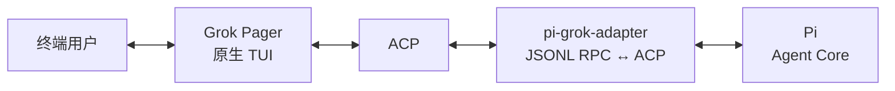
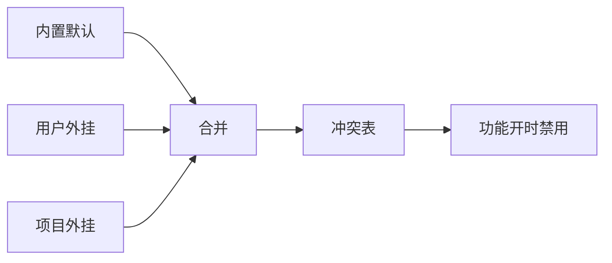

# grok-pi — Pi 与 Grok Build 的 Remote TUI 桥接

> 在 Grok Build 原生终端 UI 中运行 Pi Agent Core。

[下载最新版本](https://github.com/Dwsy/grok-pi/releases/latest) · [English](../README.md) · [功能矩阵](FEATURE_MATRIX.md) · [架构说明](NATIVE_GROK_TUI_ALIGNMENT.md) · [验证记录](VERIFICATION.md) · [更新日志](CHANGELOG.zh-CN.md) · [Changelog (EN)](../CHANGELOG.MD)

> **Remote TUI 桥接。** Pi 的交互式组件通过 Grok Build 原生 Pager 渲染，在保留 Grok 终端体验的同时接入 Pi 的扩展生态。Pi 用户获得 Grok Build 的原生 UI；Grok Build 用户获得 Pi 的模型、工具、会话和扩展能力。

`grok-pi` 将 Pi Agent Runtime 接入 Grok Build 原生 Pager。Pi 负责模型、工具、扩展、会话和 Agent 执行；Grok Pager 负责终端 UI，且是唯一的可见终端界面。

## 安装

### macOS / Linux

```bash
curl -fsSL https://github.com/Dwsy/grok-pi/releases/latest/download/install.sh | sh
```

### Windows

```powershell
irm https://github.com/Dwsy/grok-pi/releases/latest/download/install.ps1 | iex
```

安装脚本会按平台选择 release asset：

| 平台 | Asset |
|---|---|
| macOS Apple Silicon | `grok-pi-macos-aarch64.tar.gz` |
| macOS Intel | `grok-pi-macos-x86_64.tar.gz` |
| Linux x86_64 | `grok-pi-linux-x86_64.tar.gz` |
| Linux ARM64 | `grok-pi-linux-aarch64.tar.gz` |
| Windows x64 | `grok-pi-windows-x86_64.zip` |
| Windows ARM64 | `grok-pi-windows-aarch64.zip` |

默认路径：Unix → `~/.local/bin`；Windows → `%LOCALAPPDATA%\grok-pi\bin`。可用 `GROK_PI_INSTALL_DIR` 覆盖，用 `GROK_PI_VERSION=vX.Y.Z` 钉版本。

Unix 会创建 `pi-grok` 符号链接（Windows 为 `pi-grok.exe` 硬链/副本）：

```bash
grok-pi --help   # 原始名称
pi-grok --help   # 别名
```

`grok-pi` 需要 [Pi](https://pi.dev) **0.84.3 或更高版本**（系统 `pi` / pi.dev 安装器）：

```bash
# 推荐
curl -fsSL https://pi.dev/install.sh | sh
# Windows:
# powershell -c "irm https://pi.dev/install.ps1 | iex"
# 或 npm:
npm install --global @earendil-works/pi-coding-agent
```

Windows 上若旧版 `grok-pi.exe` 找不到裸名 `pi`，可显式指定 shim：

```powershell
$env:PI_BIN = "$env:LOCALAPPDATA\pi-node\current\pi.cmd"
grok-pi --pi-bin $env:PI_BIN
```

## 启动

首次使用 —— 先启动供应商配置 WebUI（写入 Pi 的 `~/.pi/agent/models.json`，带备份 + 原子写入，运行中的实例会热加载）：

```bash
grok-pi config
```

在任意项目目录下直接运行：

```bash
grok-pi
# 或
pi-grok
```

默认使用 PATH 上的 `pi`，并以当前工作目录作为项目目录。继续上一会话：`grok-pi --continue`。

常用命令：

```bash
grok-pi --help
grok-pi update --check
grok-pi update
```

## 能力概览

| 领域 | 能力 |
|---|---|
| Agent Runtime | Pi 模型、Provider、工具、扩展、skills、会话、重试和压缩 |
| 模型管理 | `/pi-models` 提供原生 Provider → Model → Details 编辑器，含安全 `models.json` 事务、备份/恢复、Pi 热重载和 typed 激活；`/model` 保留为快速切换器 |
| 供应商配置 | `grok-pi config` 启动本地 WebUI（cclite 风格）编辑 Pi 供应商、API Key 与模型列表，写 `models.json` 带备份 + 原子保存 |
| 终端 UI | Grok Pager 输入、斜杠补全、Markdown、工具卡片、diff、对话框和 scrollback |
| 产品教程 | `/tutorial`（别名 `/tour`、`/onboarding`）展示 18 个 grok-pi 能力域：Pager 原生工作流、Pi Provider/模型/工具/会话、扩展/Skill/Package 生态、产品桥接、可选自动化与明确边界 |
| **Remote TUI 桥接** | Pi `ctx.ui.custom` 组件通过 Grok Build 原生 Pager 渲染，不创建第二套 TUI |
| Shell 执行 | Bash 集成、后台任务、输出限制、超时和进程树清理 |
| 并行工作 | Pi 子代理，支持前台/后台执行和原生任务视图；`/subagents` 维护产品隔离的项目/全局 agent 定义。可选 Subagents V2（F2 → Agent →「Pi subagents V2」开关，或 `PI_GROK_SUBAGENTS_V2=1`）增加在当前 root session 内稳定的 `/root/...` agent path、主/子与子/子消息、嵌套 spawn，以及 `.grok-pi/teams` / `~/.grok-pi/teams` 外置 team preset |
| Rhai Workflow | 上游 `xai-workflow` 宿主（F2 **Pi workflows**）；`/workflow`、`/workflows`、`/create-workflow`；脚本目录 `~/.grok-pi/workflows` 与 `<repo>/.grok-pi/workflows` |
| 会话流程 | Resume、树导航、标签、回顾、上下文查看和会话选择器 |
| 资源管理 | Pi 扩展、skills、prompt 和主题的原生管理器 |
| 更新 | 基于 GitHub Releases 的更新检查与安装 |

详细行为和有意边界见[功能矩阵（中文）](FEATURE_MATRIX.zh-CN.md) / [English](FEATURE_MATRIX.md)。

## 架构



集成包含三个边界：

- **Grok Pager** 负责终端生命周期、输入、渲染、对话框和所有可见 UI。
- **Pi** 负责 Agent loop、模型、Provider、工具、扩展和会话。
- **`pi-grok-adapter`** 是 headless JSONL RPC ↔ ACP 桥接层，不拥有终端，也不渲染第二套 UI。

不修改 Pi 源码。Remote TUI 通过官方扩展 API 接入 Pi RPC 未暴露的能力，并将其投影到原生 Pager 承载面。

## 配置

稳定的内置桥接扩展默认启用；实验性原生命令需要显式开启。

| 变量 | 默认值 | 用途 |
|---|---:|---|
| `PI_GROK_REMOTE_TUI` | `1` | 启用 Pi `ctx.ui.custom` 组件 |
| `PI_GROK_BASH` | `1` | 启用 Grok-owned Bash 集成 |
| `PI_GROK_NATIVE_COMMANDS` | `0` | 启用实验性的 `/pi-*` 命令 |
| `PI_GROK_SUBAGENTS_V2` | `0` | 在 Pi subagents 上启用可选 V2 team tools（`spawn_team`、稳定 agent path、peer messaging、nested spawn）；与 F2「Pi subagents V2」开关等效 |
| `GROK_HOME` | `~/.grok-pi` | 用户状态根目录（与 stock Grok 的 `~/.grok` 隔离） |
| `GROK_PROJECT_DIR` | `.grok-pi` | 仓库内项目配置/workflows/hooks 目录名 |
| `GROK_PI_NO_AUTO_UPDATE` | 未设置 | 禁用后台更新检查 |

Subagents V2 的 team preset 使用 JSON，放在 `<repo>/.grok-pi/teams` 或 `~/.grok-pi/teams`（项目覆盖全局，全局覆盖 bundled preset）；agent profile 继续使用对应 `agents/` 目录里的外置 Markdown。示例：

```json
{
  "name": "implementation",
  "description": "Implementation plus review",
  "members": [
    { "name": "implementer", "agent": "general-purpose", "task": "Implement: {{task}}" },
    { "name": "reviewer", "agent": "explore", "task": "Review: {{task}}" }
  ]
}
```

启动 grok-pi 前用 F2「Pi subagents V2」开关或设置 `PI_GROK_SUBAGENTS_V2=1`；用 `/subagent-teams` 查看 preset。`spawn_team` 启动整组 preset，`spawn_team_agent`、`team_send_message`、`team_followup_task`、`team_wait`、`team_list`、`team_interrupt` 提供底层协作面。Rhai Workflow 仍负责确定性编排；Team V2 负责 session-scoped、可跨单次 run 复用的 agent identity 和 peer messaging。

Rhai Workflow **默认关闭**（F2 → Agent → **Pi workflows**，改完后需**整进程重启**）。细节见 [功能矩阵](FEATURE_MATRIX.zh-CN.md)、[AGENTS.md 产品态隔离](../AGENTS.md#product-state-isolation)。

Herdr 生命周期上报**默认关闭**。可在 F2 → Agent → **Pi Herdr integration** 中开启，然后重启。详见 [Herdr 设置指南](usage/grok-pi-herdr.zh-CN.md)。

使用 `--no-extensions`（`-ne`）可关闭 Pi 扩展自动发现；显式 `-e` 路径与 grok-pi 宿主桥接仍会加载。使用 `--no-bridge-extensions` 可关闭内置宿主桥接；组合两个开关可实现完全无扩展启动。Pi 启动参数可放在 `--` 之后直接传递：

```bash
grok-pi -- --model openai/gpt-4o
```

## 从源码构建

环境要求：Rust **1.92.0**、Node.js **22.19.0 或更高版本**、npm，以及系统 Pi 安装。

```bash
./build.sh
./target/debug/grok-pi
# 或: PI_BIN=pi ./run-local.sh
```

项目内 Cargo 命令应使用 `./scripts/cargo-shared.sh`：默认启用增量编译，
生成的 target 默认上限为 128 GiB，并在剩余空间低于 20 GiB 前停止。
可用 `CARGO_TARGET_MAX_GIB` 覆盖容量上限；周期性 maintenance 会先清理
incremental 缓存，若已超限的 target 仍过大则执行 `cargo clean`。只有明确确认
风险时才覆盖 `CARGO_MIN_FREE_GIB`；单次命令可用 `CARGO_MAINTENANCE=0`
跳过命令前 maintenance。运行中的 disk guard 持续检查剩余空间，target 容量
检查按 maintenance 周期执行。

运行验证：

```bash
./verify.sh
```

静态检查与运行时验收的区别见[验证记录](VERIFICATION.md)。

## 文档

- [功能矩阵](FEATURE_MATRIX.zh-CN.md) —— 支持的行为与有意边界（[English](FEATURE_MATRIX.md)）
- [Subagents V2 使用指南](usage/subagents-v2.zh-CN.md) —— 可选 team 协作、稳定 path、preset、队列语义、回滚与排障（[English](usage/subagents-v2.md)）
- [架构对齐](NATIVE_GROK_TUI_ALIGNMENT.md) —— 组件所有权、协议映射和迁移说明
- [验证记录](VERIFICATION.md) —— 已完成检查与环境阻塞项
- [更新日志](CHANGELOG.zh-CN.md) / [Changelog (EN)](../CHANGELOG.MD) —— 版本历史（中英）
- [贡献指南](../CONTRIBUTING.md) —— 贡献流程

## 许可证

项目及上游声明见 [LICENSE](../LICENSE) 和 [THIRD-PARTY-NOTICES](../THIRD-PARTY-NOTICES)。

## 功能开关 → 会禁用的 Pi 扩展

当 grok-pi **原生能力开启**时，宿主资源准入可能 block 已知冲突的 Pi 包，避免工具名/职责撞车。内置默认表：[`crates/codegen/xai-grok-pager/assets/native_feature_conflicts.toml`](../crates/codegen/xai-grok-pager/assets/native_feature_conflicts.toml)。运行时外挂（免 rebuild）：`$GROK_HOME/native-feature-conflicts.toml`，再 `$GROK_PROJECT_DIR/native-feature-conflicts.toml`（packages **并集**；非空 `reason` 覆盖）。用户资源策略的 `allow` 仍可豁免。



| 功能开关 | 如何开启 | 默认 | 会禁用的包（npm） |
|---|---|---:|---|
| **Q&A**（`pi_ask_user_question`） | F2 → Agent → Q&A（需重启） | 关 | `@juicesharp/rpiv-ask-user-question` |
| **Q&A 桌面通知**（`pi_ask_user_question_notifications`） | F2 → Agent → Q&A desktop notifications | 开 | — |
| **Pi goal mode**（`pi_goal`） | F2 → Agent → Pi goal mode（需重启） | 关 | `pi-codex-goal`、`@narumitw/pi-goal`、`@misunders2d/pi-goal`、`pi-goal`、`pi-goal-x` |
| **Pi workflows**（`pi_workflows`） | F2 → Agent → Pi workflows（需重启） | 关 | `@quintinshaw/pi-dynamic-workflows` |
| **Pi subagents**（`pi_subagents`） | F2 → Agent → Pi subagents（需重启） | 开 | `pi-subagents`、`@tintinweb/pi-subagents`；原生 `/subagents` 管理隔离的项目/全局 Markdown agent 定义。V2 另用 F2「Pi subagents V2」开关或 `PI_GROK_SUBAGENTS_V2=1` 开启；`/subagent-teams` 发现 project/global/bundled JSON preset |
| **`/btw`**（`pi_btw`） | F2 → Agent → Pi /btw（需重启）；已保存答案可用 `/btw-history` 查看 | 关 | `pi-btw`、`@narumitw/pi-btw`、`@juicesharp/rpiv-btw` |
| **用户消息 Markdown**（`pi_user_markdown`） | F2 → Agent → Markdown user messages | 开 | — |

Eval bridge 的版本在进程启动时互斥选择，默认仍为 Eval v1。Eval Bridge v2 可启用 JavaScript、Python 或两者：

```toml
[ui]
pi_eval = "v2"
pi_eval_v2_language = "all"         # "js"（默认）、"py" 或 "all"
pi_eval_v2_display_mode = "effects" # "effects"（默认）或 "legacy"
```

使用 `pi_eval = "v1"`（或省略该键）即为 legacy Eval。Eval v1 保留持久化 Python/JavaScript kernel；Eval Bridge v2 使用隔离 cell，并通过显式 `store/load` 跨 cell 持久化，同时按 `pi_eval_v2_language` 暴露语言。`pi_eval` 是单值版本 selector，因此 v1/v2 不会双活；`pi_eval` 与 `pi_eval_v2_language` 都需要重启 `grok-pi` 生效。

`pi_eval_v2_display_mode` 只控制展示并会立即生效：`effects` 会在普通会话记录中隐藏 Eval v2 的编排源码，重点展示其 effects/结果；`legacy` 恢复源码 + 结果的传统展示。可通过 **F2 → Agent → Eval v2 display**、`[ui].pi_eval_v2_display_mode`，或 `/eval-display [effects|legacy]` 修改；不带参数执行 `/eval-display` 会在两种模式间切换。所选模式会持久化到后续会话。

关闭 Pi subagents 后，下次启动会省略内置桥接、强制 `PI_GROK_SUBAGENTS=0`，并重新放行与其冲突的第三方包。

对应 F2 项的说明文案会附带 **When on, blocks: …**（与同一张表同步）。
